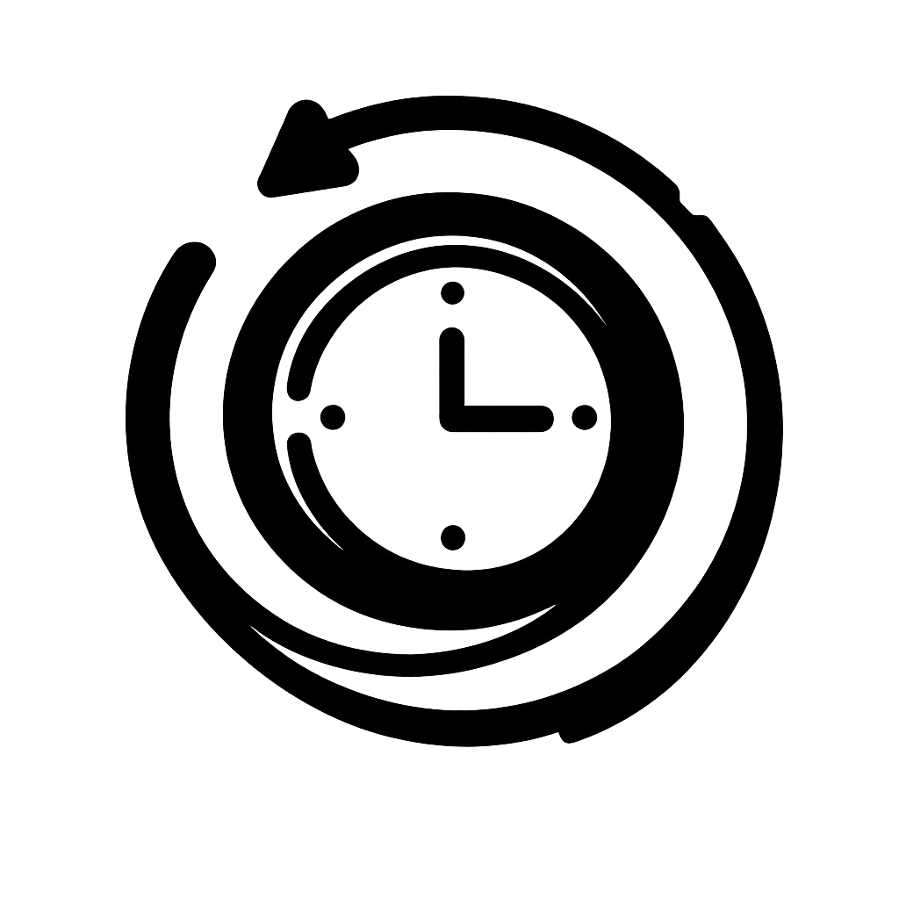

<div align="center">



# Retrospectrix

**Доска для ретроспектив в реальном времени**

Создай доску, отправь ссылку команде и работайте вместе — без регистрации.

[](https://github.com/neckita39/retro-board/actions/workflows/ci.yml)


</div>

---

## Возможности

<table>
<tr>
<td width="50%">

**Три колонки** — Что прошло хорошо, Что пошло не так, Что улучшить

**Реальное время** — совместная работа через WebSocket

**Голосование** — лайки и дизлайки на карточках

**Комментарии** — обсуждение прямо на доске

</td>
<td width="50%">

**Таймер** — ограничение времени на обсуждение

**Тёмная тема** — переключение одной кнопкой

**i18n** — английский и русский

**Экспорт** — JSON или Markdown

</td>
</tr>
</table>

**Шифрование** (AES-256-GCM) · **Мониторинг** (StatsD + Netdata) · **CI/CD** (GitHub Actions)

---

## Быстрый старт

```bash
git clone https://github.com/neckita39/retro-board.git
cd retro-board
docker compose up -d --build
```

Открывай http://localhost:3777

---

## Конфигурация

Скопируй `.env.example` в `.env`:

| Переменная | Описание | По умолчанию |
|-----------|----------|-------------|
| `DATABASE_URL` | Подключение к PostgreSQL | `postgresql://retro:retro@db:5432/retro` |
| `PORT` | Порт приложения | `3000` |
| `ORIGIN` | URL для CORS | `http://localhost:3777` |
| `ENCRYPTION_KEY` | Ключ шифрования (64 hex) | пусто = без шифрования |

Сгенерировать ключ: `openssl rand -hex 32`

**Продакшен:**

```bash
docker compose -f docker-compose.prod.yml up -d --build
```

---

## Тесты

```bash
npm test
```

---

## CI/CD

При пуше в `main` GitHub Actions автоматически:

```
push → install → test → build → deploy
```

---

<details>
<summary><b>Шифрование</b></summary>

<br>

При установке `ENCRYPTION_KEY` содержимое карточек, имена авторов и комментарии шифруются AES-256-GCM перед записью в БД. Без ключа данные хранятся как есть.

Старые данные, созданные до включения шифрования, продолжают работать.

</details>

<details>
<summary><b>Мониторинг</b></summary>

<br>

```
App (Pino logs + StatsD UDP) → Netdata Agent → Netdata Cloud
```

| Эндпоинт | Назначение |
|----------|------------|
| `GET /health` | Liveness-проверка |
| `GET /ready` | Readiness-проверка (с БД) |
| `GET /metrics` | Метрики приложения |

**Настройка Netdata Cloud:**

1. Зарегистрироваться на [app.netdata.cloud](https://app.netdata.cloud)
2. Создать Space → Room → "Connect Nodes" → Docker
3. Добавить в `.env`:
   ```env
   NETDATA_CLAIM_TOKEN=your-claim-token
   NETDATA_CLAIM_ROOMS=your-room-id
   ```
4. `docker compose -f docker-compose.prod.yml up -d`

**Логи:**

```bash
docker compose -f docker-compose.prod.yml logs app -f
```

Уровень: `LOG_LEVEL` (default: `info`). Rotation: 3 файла × 10MB.

</details>

---

## Стек

<table>
<tr>
<td align="center"><br><b>SvelteKit</b></td>
<td align="center"><br><b>Tailwind</b></td>
<td align="center"><br><b>Socket.IO</b></td>
<td align="center"><br><b>PostgreSQL</b></td>
<td align="center"><br><b>Vitest</b></td>
<td align="center"><br><b>Actions</b></td>
</tr>
</table>
